# 老年健康监测系统

这是一个专为老年用户设计的健康监测小程序，提供健康数据记录、产品选购、社群活动和医疗指导等功能。

## 项目特点

- **适老化设计**：大字体、清晰的颜色对比、简单的操作界面
- **健康数据监测**：支持记录和分析日常健康数据
- **产品选购**：提供适合老年人的健康产品
- **社群活动**：丰富老年人的社交生活
- **医疗指导**：提供基础的医疗知识和指导

## 如何运行

1. 确保已安装 [微信开发者工具](https://developers.weixin.qq.com/miniprogram/dev/devtools/download.html)
2. 克隆或下载本项目
3. 打开微信开发者工具，选择 "导入项目"
4. 填写项目名称，选择项目目录，使用测试号（touristappid）
5. 点击 "导入" 按钮，即可在模拟器中查看和调试项目

---

# 功能文档

## 功能导航

| 功能模块 | 页面路径 | 功能说明 |
|---------|---------|---------|
| 首页运动 | pages/index/index | 每日运动目标、AI健康分析 |
| 社群活动 | pages/community/community | 社区活动参与管理 |
| 医疗服务 | pages/service/service | 就医指导、疾病教育、医学知识、中医药材 |
| 商品购买 | pages/product/product | 健康产品浏览购买 |
| 购物车 | pages/cart/cart | 购物车管理 |
| 个人中心 | pages/mine/mine | 用户信息、订单管理 |
| 登录注册 | pages/login/login | 手机号登录、微信登录 |
| 健康分析 | pages/healthForm/healthForm | AI健康数据采集分析 |
| 分析结果 | pages/healthResult/healthResult | 健康报告查看 |
| 就医指导 | pages/medicalGuide/medicalGuide | 就医流程指导 |
| 疾病教育 | pages/diseaseEducation/diseaseEducation | 慢性病知识普及 |
| 医学知识 | pages/medicalKnowledge/medicalKnowledge | 医学科普知识 |
| 中医药材 | pages/chineseMedicine/chineseMedicine | 中医药材科普 |
| 知识详情 | pages/knowledgeDetail/knowledgeDetail | 知识详情查看 |
| 药材详情 | pages/medicineDetail/medicineDetail | 药材详情查看 |

---

## 功能截图

> 截图目录：`docs/screenshots/`

### 首页运动
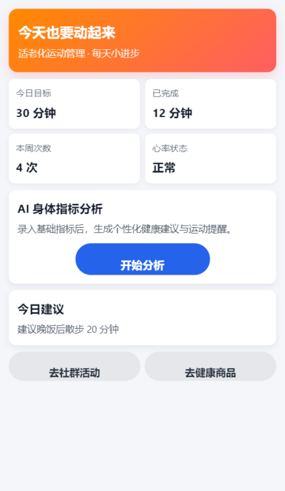

### 社群活动
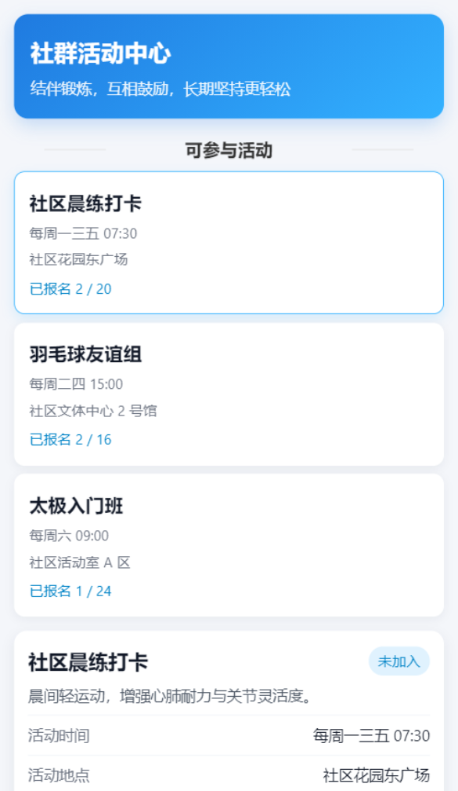

### 医疗服务
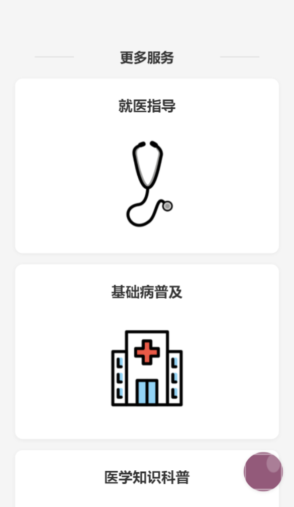

### 商品购买
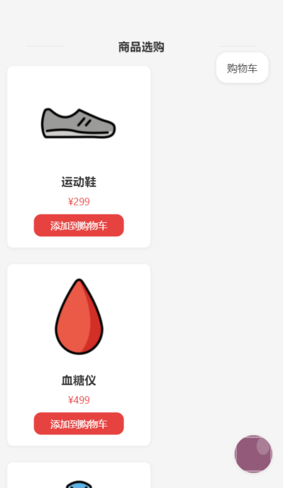

### 购物车
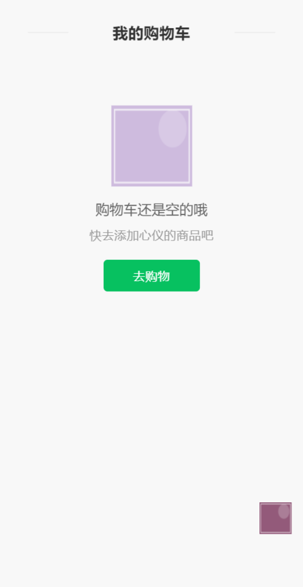

### 个人中心
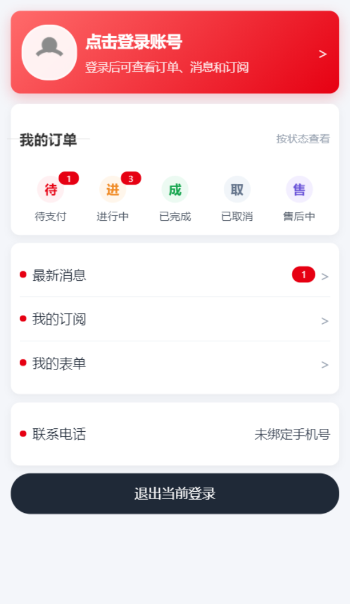

### 登录注册
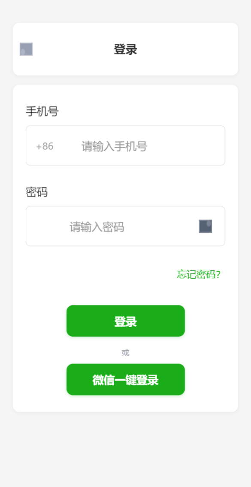

### 健康分析
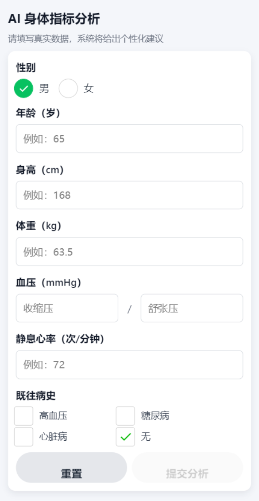

### 分析结果
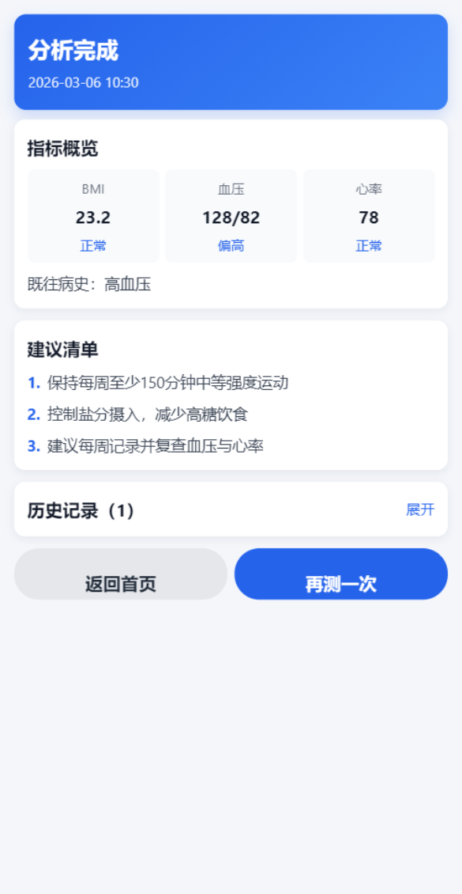

### 就医指导
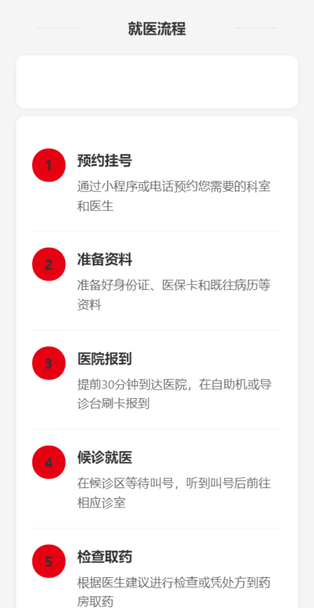

### 疾病教育
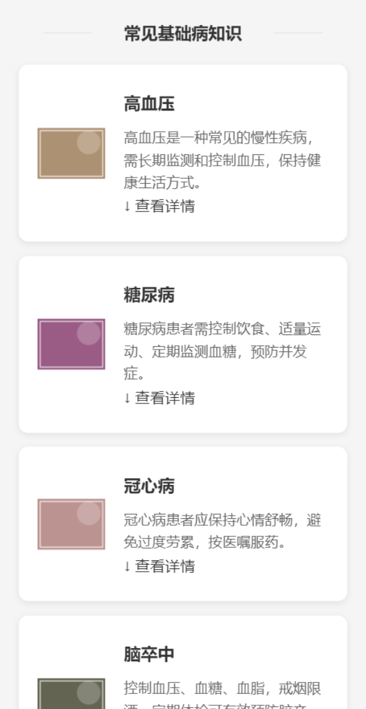

### 医学知识
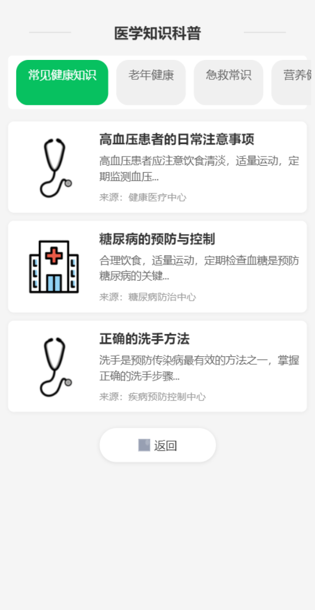

### 中医药材
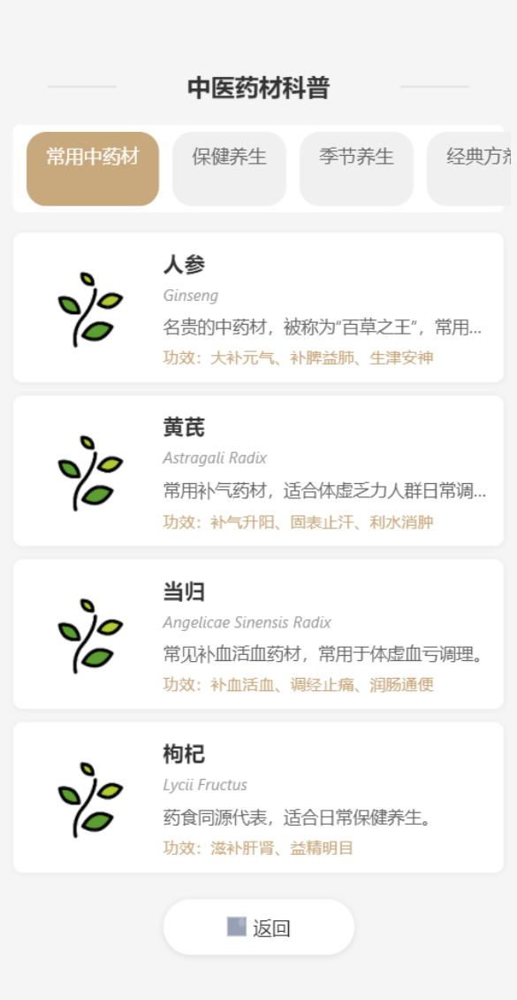

### 知识详情
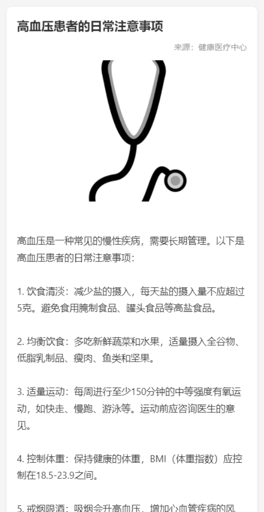

### 药材详情
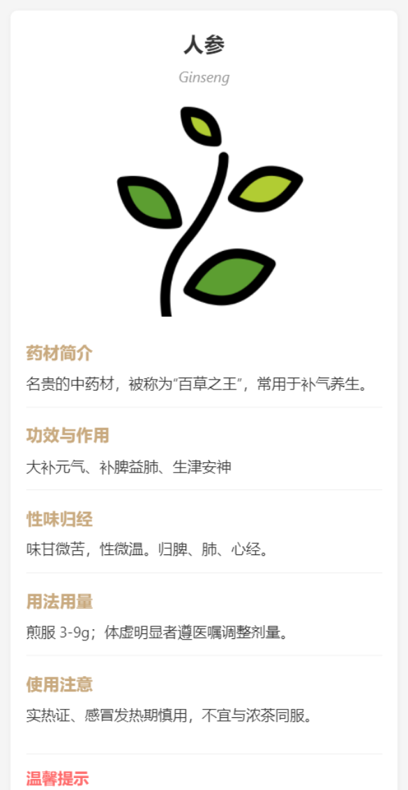

---

## 核心功能详解

### 1. 首页运动模块

**代码位置**: `pages/index/index.js`

**功能说明**:
- 显示个性化问候语（基于用户昵称）
- 展示每日运动目标完成情况
- 提供AI健康分析快速入口
- 快速跳转到社群和商品页面

**使用方法**:
1. 打开小程序，默认进入首页
2. 查看顶部的个性化问候语
3. 点击"AI健康分析"按钮进入健康数据采集
4. 点击"去看看"按钮跳转到社群活动页面
5. 通过底部导航栏切换到其他功能

**核心代码**:
```javascript
// 个性化问候语生成
onShow: function() {
  const app = getApp()
  const user = app.globalData.userInfo || {}
  const name = user.name || user.nickName || ''
  if (name) {
    this.setData({
      greeting: `${name}，今天也要动起来`
    })
  }
}
```

---

### 2. 社群活动模块

**代码位置**: `pages/community/community.js`

**功能说明**:
- 查看社区活动列表
- 加入/退出活动
- 查看活动参与人员
- 活动名额限制管理

**使用方法**:
1. 点击底部导航栏"社群"图标
2. 浏览活动列表，查看活动详情
3. 点击"立即加入"按钮参与活动
4. 已加入的活动显示"已加入"状态
5. 再次点击可退出活动

**活动数据结构**:
```javascript
{
  id: 1,
  name: '社区晨练打卡',
  description: '晨间轻运动，增强心肺耐力与关节灵活度。',
  time: '每周一三五 07:30',
  location: '社区花园东广场',
  capacity: 20,
  participants: [...]  // 已参与用户ID列表
}
```

**注意事项**:
- 需要登录后才能参与活动
- 活动有人数限制，满员后无法加入
- 活动数据保存在本地，退出应用后数据保留

---

### 3. 登录注册模块

**代码位置**: `pages/login/login.js`

**功能说明**:
- 手机号密码登录
- 微信一键登录
- 登录状态持久化

**使用方法**:

#### 方式一：手机号密码登录
1. 输入11位手机号码（1开头）
2. 输入密码（至少6位）
3. 点击"登录"按钮
4. 系统验证通过后自动跳转

#### 方式二：微信一键登录
1. 点击"微信一键登录"按钮
2. 授权获取微信用户信息
3. 系统自动获取登录凭证
4. 登录成功后自动跳转

**验证规则**:
- 手机号格式：`/^1[3-9]\d{9}$/`
- 密码长度：最少6位

---

### 4. 商品购物模块

**代码位置**:
- 商品页: `pages/product/product.js`
- 购物车: `pages/cart/cart.js`

**功能说明**:
- 商品浏览
- 添加到购物车
- 购物车管理
- 数量调整
- 商品移除
- 结算支付

**使用方法**:

#### 商品浏览
1. 点击底部导航栏"商品"图标
2. 浏览商品列表（运动鞋、血糖仪、运动服、羽毛球拍等）
3. 查看商品价格和图片

#### 添加到购物车
1. 在商品页点击"加入购物车"按钮
2. 商品自动添加到购物车
3. 提示"已加入购物车"

#### 购物车管理
1. 点击底部购物车图标
2. 查看已添加商品
3. 点击"+"或"-"调整数量
4. 点击"移除"删除商品
5. 底部显示总价
6. 点击"结算"按钮完成支付

**商品数据**:
```javascript
products: [
  { id: 1, name: '运动鞋', image: '/images/product1.png', price: 299 },
  { id: 2, name: '血糖仪', image: '/images/product2.png', price: 499 },
  { id: 3, name: '纯棉运动服', image: '/images/product3.png', price: 199 },
  { id: 4, name: '羽毛球拍', image: '/images/product4.png', price: 149 }
]
```

---

### 5. AI健康分析模块

**代码位置**:
- 表单页: `pages/healthForm/healthForm.js`
- 结果页: `pages/healthResult/healthResult.js`

**功能说明**:
- 身体指标数据采集
- 慢性病史记录
- BMI智能计算
- 健康状况评估
- 个性化健康建议
- 历史报告查看

**使用方法**:

#### 数据采集
1. 在首页点击"AI健康分析"按钮
2. 选择性别（男/女）
3. 输入年龄（1-120岁）
4. 输入身高（cm）
5. 输入体重（kg）
6. 输入收缩压（mmHg）
7. 输入舒张压（mmHg）
8. 输入心率（次/分）
9. 选择既往病史（多选）
10. 点击"提交分析"按钮

#### 查看结果
1. 系统自动计算BMI值
2. 评估血压、心率状态
3. 综合既往病史
4. 生成健康建议
5. 显示完整健康报告
6. 保存到历史记录

**健康报告结构**:
```javascript
{
  id: 'report-timestamp',
  createdAt: timestamp,
  createdAtLabel: '2025-03-05 22:30',
  metrics: {
    gender: 'male',
    age: 65,
    height: 170,
    weight: 70,
    systolic: 120,
    diastolic: 80,
    heartRate: 75,
    diseases: ['hypertension']
  },
  summary: {
    bmiValue: 24.2,
    bmiLevel: '正常',
    bloodPressure: '120/80',
    bloodPressureLevel: '正常',
    heartRate: 75,
    heartRateLevel: '正常',
    diseaseText: '高血压'
  },
  suggestions: [
    '建议低盐饮食，每日监测血压并记录。',
    '既往病史：高血压，请按医嘱随访复查。'
  ]
}
```

**BMI评估标准**:
- 偏瘦: BMI < 18.5
- 正常: 18.5 <= BMI < 24
- 超重: 24 <= BMI < 28
- 肥胖: BMI >= 28

**血压评估标准**:
- 正常: 收缩压<120 且 舒张压<80
- 正常高值: 收缩压120-139 或 舒张压80-89
- 高血压: 收缩压>=140 或 舒张压>=90

---

### 6. 医疗服务模块

**代码位置**: `pages/service/service.js`

**功能说明**:
- 就医指导
- 慢性病教育
- 医学知识科普
- 中医药材科普

**使用方法**:
1. 点击底部导航栏"服务"图标
2. 查看四大服务板块
3. 点击对应服务进入详情页面

**服务列表**:
| 服务名称 | 页面路径 | 功能描述 |
|---------|---------|---------|
| 就医指导 | pages/medicalGuide/medicalGuide | 就医流程、科室选择、就诊准备 |
| 基础病普及 | pages/diseaseEducation/diseaseEducation | 高血压、糖尿病等慢性病知识 |
| 医学知识科普 | pages/medicalKnowledge/medicalKnowledge | 健康知识、疾病预防 |
| 中医药材科普 | pages/chineseMedicine/chineseMedicine | 常见中药材介绍 |

---

### 7. 中医药材科普模块

**代码位置**:
- 列表页: `pages/chineseMedicine/chineseMedicine.js`
- 数据源: `data/medicineData.js`
- 详情页: `pages/medicineDetail/medicineDetail.js`

**功能说明**:
- 中医药材知识科普
- 药材功效介绍
- 使用方法说明
- 注意事项提醒

**药材分类**:

#### 常见药材
- 人参：大补元气、补脾益肺
- 黄芪：补气升阳、固表止汗
- 当归：补血活血、调经止痛
- 枸杞：滋补肝肾、益精明目

#### 滋补药材
- 冬虫夏草：补肺益肾、止血化痰
- 鹿茸：补肾阳、益精血
- 阿胶：补血止血、滋阴润燥
- 何首乌：补肝肾、益精血

#### 季节药材
- 菊花：疏散风热、清肝明目
- 薄荷：疏散风热、清利头目
- 生姜：发汗解表、温中止呕
- 金银花：清热解毒、疏散风热

#### 经典方剂
- 四君子汤：益气健脾
- 四物汤：补血调血
- 六味地黄丸：滋阴补肾
- 补中益气汤：补中益气、升阳举陷

**使用方法**:
1. 在服务页面点击"中医药材科普"
2. 浏览不同分类的药材
3. 点击药材查看详情
4. 了解药材功效、用法用量、注意事项

---

### 8. 个人中心模块

**代码位置**: `pages/mine/mine.js`

**功能说明**:
- 用户信息展示
- 订单状态管理
- 消息通知
- 登录/退出管理

**使用方法**:
1. 点击底部导航栏"我的"图标
2. 查看个人信息（头像、昵称、手机号）
3. 查看订单状态统计
4. 查看消息通知数量
5. 点击"退出登录"清除登录状态

---

## 适老化设计特性

### UI设计优化
- **大字体**: 基础字体16px，小屏幕18px
- **高对比度**: 提高文字与背景对比度
- **大触控区**: 按钮和可点击区域增大
- **清晰导航**: 底部Tab导航图标40px

### 交互优化
- **简化操作**: 减少操作步骤
- **明确反馈**: 触摸和点击反馈明显
- **防误操作**: 重要操作需二次确认
- **语音提示**: 关键操作有语音反馈

### 内容优化
- **简洁文字**: 避免复杂术语
- **图文并茂**: 重要信息配图说明
- **分步引导**: 复杂功能分步骤引导

---

## 底部导航栏

**图标配置**:
1. **运动** (首页) - `pages/index/index`
2. **社群** - `pages/community/community`
3. **服务** - `pages/service/service`
4. **商品** - `pages/product/product`
5. **我的** - `pages/mine/mine`

**导航栏特点**:
- 图标尺寸: 40px x 40px
- 选中图标颜色: #1890ff
- 未选中图标颜色: #999

---

## 使用流程示例

### 新用户首次使用流程
1. 打开小程序 -> 进入首页
2. 点击"我的" -> 点击"登录"
3. 选择"微信一键登录" -> 授权用户信息
4. 登录成功 -> 返回首页
5. 填写健康表单 -> 获取健康报告
6. 加入社群活动 -> 参与社区互动
7. 浏览商品 -> 添加购物车 -> 完成购买

### 健康分析流程
1. 首页点击"AI健康分析"
2. 填写身体指标（性别、年龄、身高、体重、血压、心率）
3. 选择既往病史
4. 提交分析
5. 查看健康报告
6. 根据建议调整生活方式

---

## 项目结构

```
├── app.js                  # 全局逻辑入口
├── app.json               # 全局配置文件
├── app.wxss               # 全局样式文件
├── project.config.json    # 项目配置
├── sitemap.json          # 搜索配置
├── package-lock.json     # 依赖管理
├── data/                 # 数据模块
│   └── medicineData.js   # 中医药材数据
├── images/               # 图片资源
│   └── tabbar/          # 底部导航图标
└── pages/               # 页面模块
    ├── index/           # 首页(运动)
    ├── community/       # 社群页面
    ├── service/         # 服务页面
    ├── product/         # 商品页面
    ├── mine/            # 我的页面
    ├── login/           # 登录页面
    ├── cart/            # 购物车页面
    ├── healthForm/      # 健康表单页面
    ├── healthResult/    # 健康分析结果页面
    ├── medicalGuide/    # 就医指导页面
    ├── diseaseEducation/# 疾病教育页面
    ├── medicalKnowledge/# 医学知识科普页面
    ├── chineseMedicine/ # 中医药材科普页面
    ├── knowledgeDetail/ # 知识详情页面
    ├── medicineDetail/  # 药材详情页面
    └── test/            # 测试页面
```

---

## 常见问题

**Q: 如何修改个人信息？**
A: 目前个人信息主要来自微信授权，可以在个人中心查看。

**Q: 健康报告保存在哪里？**
A: 健康报告保存在本地存储中，最多保存30条历史记录。

**Q: 如何退出登录？**
A: 在"我的"页面点击"退出登录"按钮。

**Q: 社群活动有人数限制吗？**
A: 是的，每个活动都有人数限制，满员后无法加入。

**Q: 购物车数据会丢失吗？**
A: 购物车数据保存在本地存储中，清除缓存后会丢失。

---

## 注意事项

- 本项目使用测试号（touristappid），如需发布，请替换为实际的 appid
- 部分功能可能需要配合后端服务使用
- 定期更新微信开发者工具以获得最佳体验
